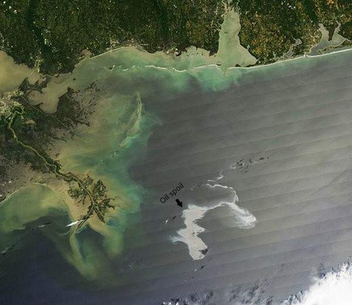
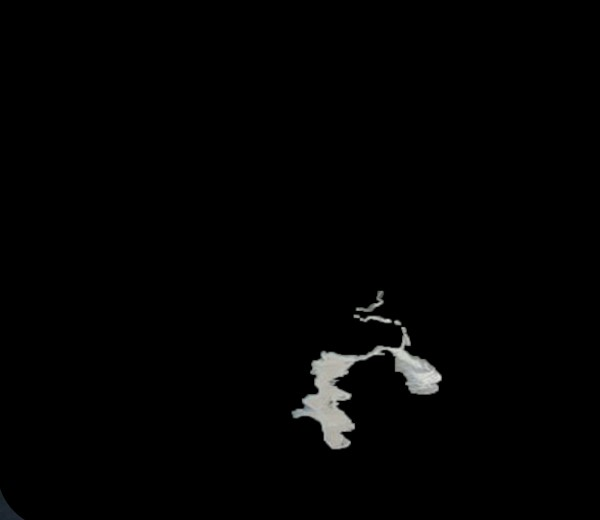
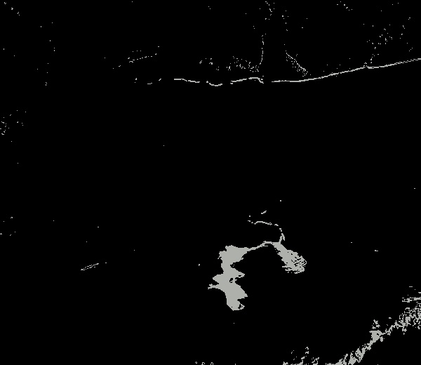
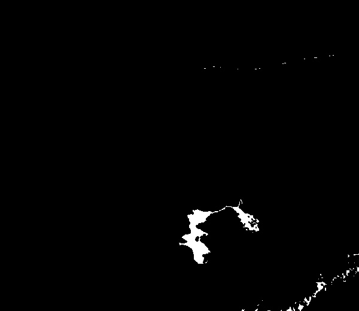

# Oil_spill_detection
A Clustering Based approach for Automated Oil Spill Detection.

## Introduction

Ανίχνευση πετρελαιοκηλίδας μέσω εικόνας δορυφόρου

Η εικόνα η οποία έχουμε στην διάθεση μας είναι η παρακάτω.

Στόχος μας είναι να εφαρμόσουμε τεχνικές κατάτμησης  ώστε να απομονώσουμε από την εικόνα τo σημείo που βρίσκεται η πετρελαιοκηλίδα.

Οι αλγόριθμοι συσταδοποίησης οι οποίοι επελαξα είναι ο **K Means** και ο **Mean shift**. 

Αφου τρέξουμε του αλγόριθμους συσταδοποίησης το επόμενο βήμα είναι να  φτιάξουμε χειροκίνητα μια annotated εικόνα όπου θα συγκρίνουμε το κάθε pixel της με αυτό της εικόνας που ανήκει σε ένα cluster.

Για να αυτοματοποιήσουμε το σύστημα μας επιλέγουμε 2 μετρικές (**Jacard Score**, **F1 score**) για να συγκρίνουμε ολα τα cluster με την annotated εικόνα ώστε να επιλέγουμε αυτόματα το καλύτερο cluster.

Το καλύτερο αποτέλεσμα που λάβαμε ηταν το παρακάτω

Βλέπουμε ότι η συστάδα αυτή έχει καλύψει το μεγαλύτερο μέρος της πετρελαιοκηλίδας παρόλα αυτά υπάρχει αρκετός θόρυβος στα άκρα της εικόνας. Ας εφαρμόσουμε ένα median filter για να εξαλείψουμε ένα μέρος αυτού. 

Καταφέραμε και απομονώσαμε σε ικανοποιητικό βαθμό την πετρελαιοκηλίδα. 

Τέλος επαναλαμβάνουμε τα βήματα αφού έχουμε πρωσθέση gausian θόρυβο στην αρχική εικόνα.

## Installation

### Environment 

I use [Anaconda](https://www.anaconda.com/products/individual) because it comes with many Python
packages already installed and it is easy to work with. After installing Anaconda,
you should create a [conda environment](http://conda.pydata.org/docs/using/envs.html)
so you do not destroy your main installation in case you make a mistake somewhere:

       conda create --name oil_spill python=3.7

Now you can switch to the new environment by running the following:

      source activate oil_spill

